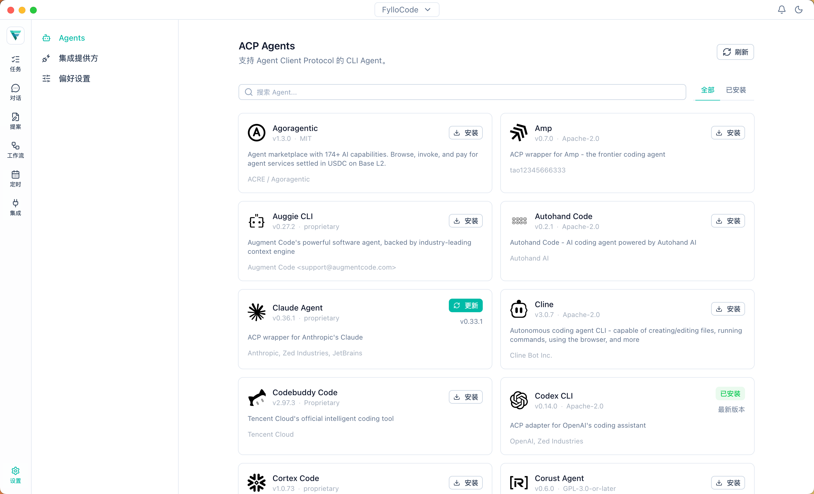
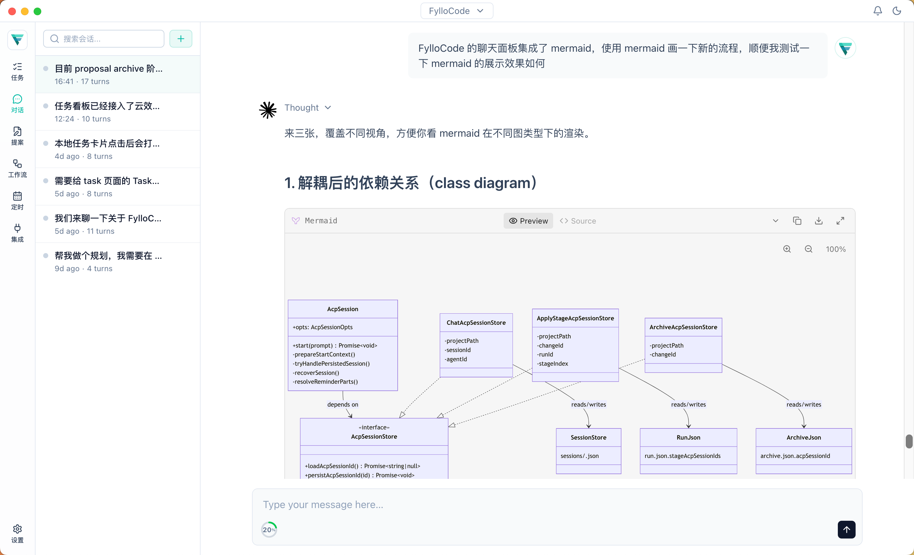
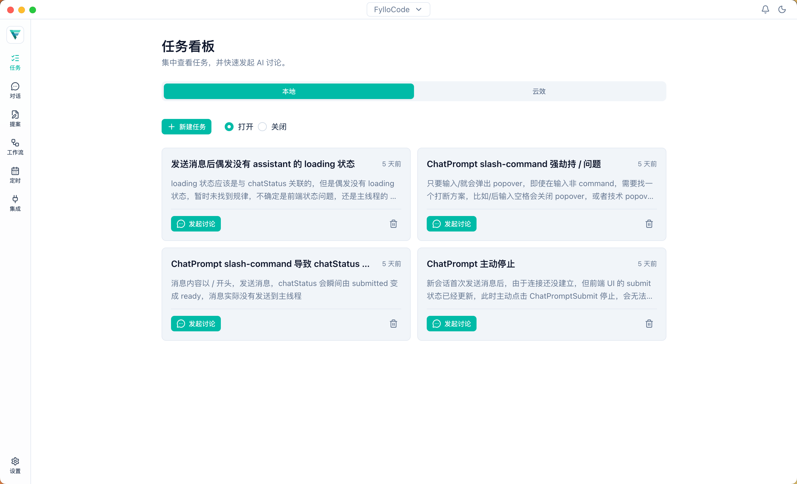
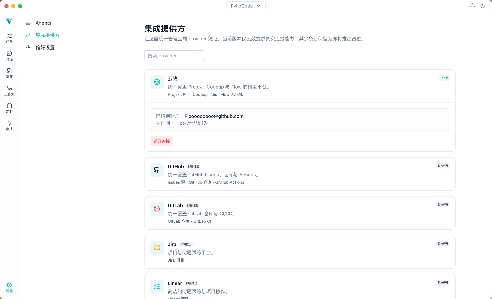
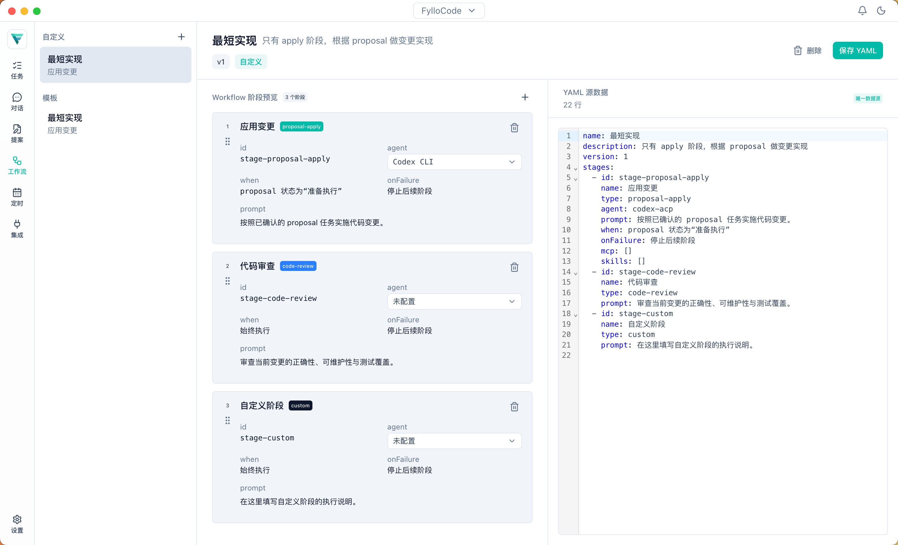
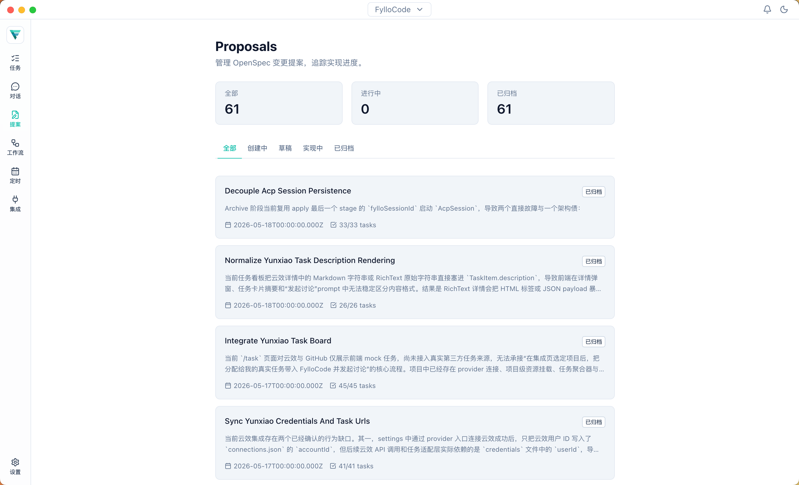
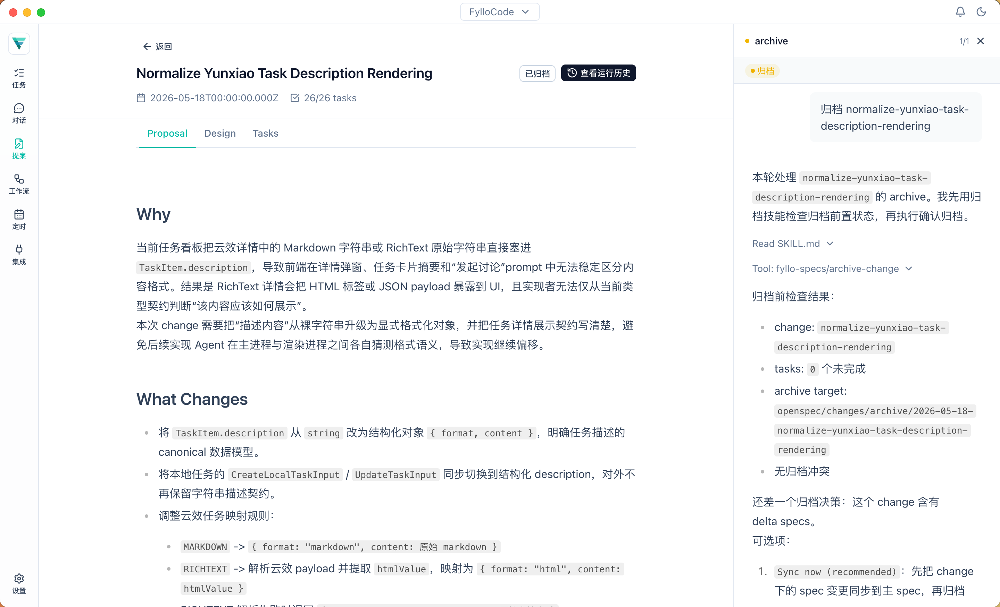

<p align="center">
  
</p>

<h1 align="center">FylloCode</h1>

<p align="center">
  一个让 Coding Agent 在复杂项目里不再跑偏的桌面应用 —<br/>
  把每次变更拆成 <strong>任务 → 提案 → 执行 → 归档</strong> 四个阶段，<br/>
  你在提案环节审查把关，Agent 才开始写代码。
</p>

<p align="center">
  <a href="./README.md">English</a> ·
  <a href="https://github.com/Fioooooooo/FylloCode/releases">下载</a>
</p>

<!-- TODO: 替换为实际截图 -->
<!--  -->

---

## 问题

Coding Agent 很强，但在真实项目里容易跑偏。给它一个任务，它会立刻开始写代码——经常理解错范围、忽略约定、或者做出你扫一眼就能拦住的决策。Session 越长，偏得越远。最后你花在审查 diff 上的时间比省下来的还多。

## FylloCode 怎么解决

FylloCode 用一套结构化的工作流，把 **思考** 和 **执行** 物理隔离：

```
┌──────────┐     ┌────────────────┐     ┌───────────┐     ┌───────────┐
│   任务   │ ──→ │  对话 / 提案     │ ──→ │   执行     │ ──→ │   归档    │
│          │     │                │     │           │     │           │
│ 做什么    │     │ Agent 探索代码  │     │ Agent 按   │     │ 规格更新   │
│          │     │ 库，写出方案     │     │ 方案逐条    │     │ 变更留档   │
│          │     │                │     │ 实现       │     │           │
│          │     │  ➜ 你来审查     │     │            │     │           │
└──────────┘     └────────────────┘     └───────────┘     └───────────┘
```

**任务** — 从本地任务列表或云效等平台同步过来的工作项中选一个，一键发起对话创建提案。

**对话 / 提案** — Agent 探索你的代码库，提出澄清问题，然后生成结构化的提案（改什么、改哪些文件、验收标准）。在这个阶段，Agent **被禁止写代码**。你审查、修改、确认提案后，流程才会继续。

**执行** — 一个全新的 Agent session 按提案逐条实现。它只读提案产物，看不到对话历史——所以所有决策必须写进提案，不能留在上下文窗口的记忆里，同时以这种方式将决策产物持久化留存。

**归档** — 规格文档更新，变更完整归档。你的项目知识库随着每次交付不断增长。

### 为什么比 Agent + Skill 更准确

大多数 Coding Agent 在同一个 session 里理解任务并写代码。任何误解都会直接变成代码，而代码的审查成本很高。

FylloCode 把理解和执行物理隔离了。误解只能变成提案文字——文字的审查成本极低。花 2 分钟审一遍提案，能拦住你在 diff 里要花 20 分钟才能发现的问题。

## 功能特性

### Agent 协议（ACP）

FylloCode 通过 [Agent Client Protocol](https://github.com/anthropics/agent-client-protocol) 连接任意 Coding Agent。Claude Code、Codex 或任何 ACP 兼容的 Agent——一个协议，一个界面。

<!-- TODO: Agent 选择截图 -->



### System Reminders

每个工作流阶段会注入 system reminder，约束 Agent 能做和不能做的事。对话阶段，Agent 被指示去探索和提案，而不是写代码；执行阶段，它只按已批准的任务列表走。这不是建议——是在 session 启动时强制执行的硬边界。



### 任务面板

查看和管理本地任务，或展示从外部平台同步的工作项。任务是整个工作流的入口——选中任务，发起对话，Agent 带着完整上下文开始工作。



### 开发平台集成

以 Provider 为单位连接平台（如云效）——一次认证，任务管理、源码管理、CI/CD 等多个工具全部可用。更多平台集成（GitHub、TAPD、Jira 等）在路线图中。



### 工作流编辑器

定义和自定义多阶段工作流。内置模板开箱即用，也可以编辑 YAML 适配你的团队流程。



### OpenSpec 驱动的提案

提案是结构化的产物，不是聊天消息。每个提案包含设计文档、规格变更和具体的任务列表（文件路径、验收标准）。内置的 `fyllo-specs` MCP server 管理完整的生命周期：explore → create-proposal → apply-change → archive-change。





## 快速开始

### 下载安装

macOS、Windows、Linux 预构建包可在 [Releases](https://github.com/Fioooooooo/FylloCode/releases) 页面下载。

| 平台    | 格式                           |
| ------- | ------------------------------ |
| macOS   | `.dmg`                         |
| Windows | `.exe`（NSIS 安装包）          |
| Linux   | `.AppImage` / `.deb` / `.snap` |

### 从源码构建

需要 Node.js ≥ 22 和 pnpm。

```bash
git clone https://github.com/Fioooooooo/FylloCode.git
cd FylloCode
pnpm install
pnpm dev
```

### 开始使用

1. 打开 FylloCode，创建或打开一个项目（任何本地代码目录）。
2. 进入 **设置 → Providers**，安装一个 ACP 兼容的 Agent（如 Claude Code）。
3. 切换到 **任务** 面板，创建一个任务，点击发起对话。
4. Agent 会探索你的代码库并生成提案。审查后，运行执行。

## Todo

- [ ] More integration(TAPD, Jira, Linear, Github)
- [ ] Auto-update
- [ ] i18n (English UI)
- [ ] Auto build guidelines
- [x] Git linked workspace for task apply
- [ ] More ACP Agent control

## 技术栈

Electron · Vue 3 · TypeScript · ACP SDK · MCP SDK · Nuxt UI · Tailwind CSS

## 许可证

[AGPL-3.0](LICENSE)
