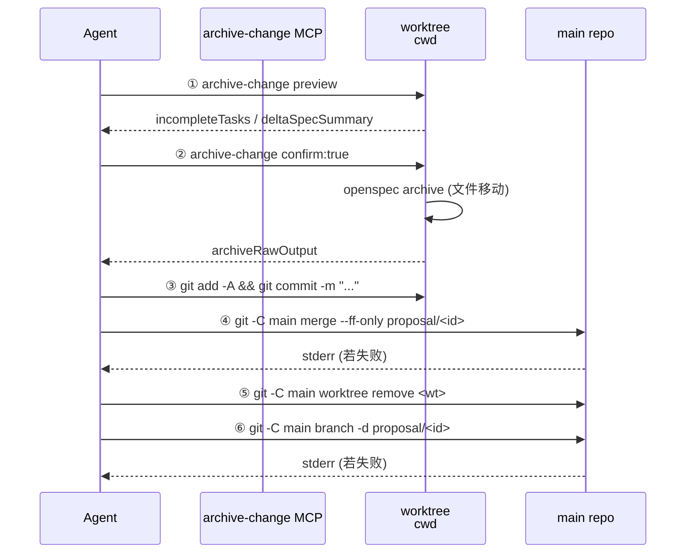

## Context

P1（`add-multi-worktree-foundation`）：主进程数据契约 + cwd fallback + MCP `targetPath` 必填。
P2（`add-chat-worktree-orchestration`）：chat 阶段编排 worktree add + 维护 .gitignore；OpenSpec change scaffold 落到 worktree 内。
P3（`add-proposal-list-worktree-scan`）：list 双源扫描 + ProposalMeta.worktreePath 写入 + 卡片标记；apply 触发后 ApplyRunMeta.worktreePath 自然写入；apply / archive ACP cwd 落到 worktree。

到 P3 结束时：

- chat 在 worktree 创建 OpenSpec → list 显示 → apply 在 worktree 上跑业务代码。
- archive 阶段 ACP cwd 也已是 worktree 绝对路径（来自 P1 的 `runMeta.worktreePath ?? projectPath`）。
- archive system-reminder（`archive.txt`）当前已经规定了"sync 主 spec → archive → commit"三步顺序，但**没有说**怎么把 worktree 内的归档 commit 合回 main、也没说要清理 worktree。

结果是磁盘上残留越来越多的 `<projectPath>/.worktrees/<changeId>/` 目录与 `proposal/<changeId>` 分支；P3 list 双源扫描虽然能识别这些 worktree，但它们的语义其实已经是"archived 但未清理"。

P4 通过修改 `archive.txt` system-reminder 与 `stage-prompts.ts` 的 archive prompt，让 agent 在 archive 阶段完成完整的 5 步收尾——**不引入任何主进程 git 调用、不改 MCP、不改 IPC 契约**，所有 git 命令都由 agent 用 Bash 执行。

**关键事实**

- archive ACP session cwd 在 P1 后是 `runMeta.worktreePath ?? projectPath`（`proposal-apply.ts:330` 由 P1 task 5.3 改为该取值）。
- `archive.txt` 现有正文已规定 commit 必须用 `type(scope): summary`，并要求"commit only files related to this change"。
- `stage-prompts.ts:38` 当前 `proposal-archive` runner 是 `归档 ${changeId} 并提交代码`，与 spec 文档（`proposal-archive-action/spec.md` 描述的"加载 skill fyllo-archive-change..."）不一致——spec drift。**P4 同时把 prompt 与 spec 对齐**，统一为最简 `归档 ${changeId}`，把"sync / commit / merge / worktree-cleanup"具体编排放到 `archive.txt` 与 `archive-change` tool_instruction 里。
- 当前 archive 阶段 reminderContext（`proposal-apply.ts:329`）已含 `changeId`、`runId`，P1 添加的 `worktreePath` 字段也已透传。
- P2 已让 `archive.txt` 模板支持 `{{worktreePath}}`、`{{mainProjectPath}}` 占位符（白名单变量已扩展）。
- 非 git 项目 / 旧 ApplyRunMeta：`runMeta.worktreePath` 为 undefined，`archive.txt` 渲染时 `{{worktreePath}}` 为空字符串，模板需要在内文显式说明此情况下跳过 git 编排。

## Goals / Non-Goals

**Goals**

- archive 阶段的 agent 在 system-reminder 引导下，完成完整 5 步收尾：sync（已存在）→ archive-change（已存在）→ commit（已存在）→ merge --ff-only 进 main → worktree remove + branch -d。
- archive 完成后 main 当前分支多一次 fast-forward merge commit 含归档移动；worktree 目录与 `proposal/<changeId>` 分支被清理。
- merge / remove / branch -d 任一步失败时 agent 把 stderr 复述给用户，**不**自动重试，不 force。
- 非 git 项目（worktreePath 为空）archive 行为完全等价于 P3 之前；reminder 文本明确这一降级路径。
- archive prompt 文案与 spec 对齐到最简 `归档 ${changeId}`；spec 文档与代码不再 drift。

**Non-Goals**

- 不引入任何主进程 git 调用、不改 MCP `archive-change` 实现（仍仅做 OpenSpec 文件移动）。
- 不引入"清理孤儿 worktree"UI 入口；用户用原生 git 命令处理失败兜底。
- 不实现 archive 失败时的"幂等续跑"——agent 收到 stderr 即把状态交还用户。
- 不把 commit message 拆出参数化模板：commit message 由 agent 在 chat-aware 上下文中生成，archive.txt 规定格式但不规定 message 文本。
- 不修改 chat 阶段（P2）/ apply 阶段（P3）的任何编排。

## Decisions

### D1：4 步 git 收尾全部由 agent 用 Bash 执行

**选择**：archive system-reminder 内文写明 4 步命令模板（commit → merge → worktree remove → branch -d），agent 用 Bash 工具逐条执行。MCP `archive-change` 仍只做 OpenSpec 文件移动，不引入任何 git 子进程。

**理由**：

- 与 P2 的 worktree add 编排一致：MCP 不 owning git workflow，agent 用 Bash 是 git 操作的统一执行者。
- merge 冲突 / remove 失败 / branch -d 失败的 fallback 都需要 agent 与用户对话决策，把 git 操作放在 MCP 内部反而切断了 agent 的接管路径。
- 用户的 hooks / signing config 通过 agent 的 Bash 自然继承。

**否决**：

- archive-change tool 内置 4 步 git 收尾——P1 设计阶段已明确否决（MCP = 文件级原子操作；多步带判断的工作流交给 agent）。
- 主进程在 archive done 之后调 git——FylloCode 主进程当前完全不调 git，不在本次扩展范围内。

### D2：merge --ff-only，失败由 agent 接手

**选择**：reminder 文本硬规定 `git -C {{mainProjectPath}} merge --ff-only proposal/{{changeId}}`。失败时 agent 把 stderr 完整复述给用户，不自动 fall back 到普通 merge / rebase。

**理由**：

- `--ff-only` 是最干净的常规路径——main 历史保持线性，不引入额外 merge commit。
- 失败的最常见原因是 main 在 worktree 创建后被推进（团队协作场景）。这种情况要么 rebase 要么普通 merge，决策权应在用户而非 agent。
- 不自动重试避免破坏用户工作树（pull --rebase 可能踩到本地未 commit 改动等边界）。

#### 选项对比

| merge 策略            | 优点                        | 痛点                                                                                         |
| --------------------- | --------------------------- | -------------------------------------------------------------------------------------------- |
| `--ff-only`（本设计） | main 历史线性；失败明确暴露 | 失败时需用户介入                                                                             |
| 默认 merge            | 永远成功                    | main 历史多 merge commit；archived 工作流的"工具元变更"不应制造 merge commit                 |
| `--squash`            | 单 commit                   | 丢失 worktree 内中间 commit；多次 commit 就有用的工作流（apply 阶段多个业务 commit）会被压扁 |

### D3：worktree remove 与 branch delete 顺序与失败处置

**选择**：`worktree remove <worktreePath>` 在前，`branch -d proposal/<changeName>` 在后。两步都用普通命令（不用 `--force` / `-D`）。任一失败把 stderr 复述给用户。

**理由**：

- worktree remove 失败的典型原因：编辑器锁文件、worktree 内有未 commit 改动（agent 应在 commit 步骤就处理掉，但万一没干净）。`--force` 会硬删导致用户看不到自己未保存的工作；reminder 让 agent 复述 stderr，用户手动 close 编辑器或 `--force` 决策更安全。
- branch -d 失败原因：分支未完全合并（理论上 merge --ff-only 成功后不会发生；但若用户手动 reset main 后重跑，分支会"超前于 main"）。`-D` 强删失去这个保护，让 agent 复述 stderr 即可。

### D4：archive prompt 精简，编排移到 system-reminder + tool_instruction

**选择**：`stage-prompts.ts` 中 `proposal-archive` 改为 `归档 ${changeId}`。所有"sync / archive-change / commit / merge / worktree-cleanup"具体步骤都不再写在 prompt 里，全部交给：

- **archive.txt system-reminder**：详细写整个 5 步顺序、命令模板、失败处置、commit message 格式（已存在的 `<rules>` `<critical>` 内容继续保留）。
- **archive-change tool_instruction**：MCP 工具自身的"sync 主 spec → archive 文件移动 → 报告状态"约束。

**理由**：

- 多处重复表述同一个工作流必然 drift。当前 spec 写的"加载 skill fyllo-archive-change..."与 stage-prompts 的 `归档 ${changeId} 并提交代码` 已经 drift 了，本次顺势对齐。
- prompt 是用户消息，每次 archive 启动都会写入 archive.messages.jsonl，文本越短越便于人类回读。
- system-reminder 是注入式 prompt，不会污染消息历史，承载长流程编排是它的职责。

### D5：非 git 项目 / 空 worktreePath 的降级写在 reminder 内文

**选择**：`archive.txt` 的 `<worktree>` 段开头明确："如果 `{{worktreePath}}` 为空，跳过本段全部 git 编排，仅按现有 `<rules>` 完成 archive-change + commit 即可"。

**理由**：

- 现有 archive.txt 的 commit 步骤本来就在 worktreePath 不存在时也工作（cwd 是主仓库，commit 落到主仓库当前分支，与 P3 之前行为等价）。
- agent 通过文本判断 `{{worktreePath}}` 是否为空，比通过条件分支模板（chat / apply 都没有此先例）更简单；模板渲染保持单一路径。

### D6：archive.txt 与 archive prompt 不引用 worktreePath 之外的 ApplyRunMeta 字段

**选择**：archive.txt `<worktree>` 段只引用 `{{worktreePath}}`、`{{mainProjectPath}}`、`{{changeId}}` 三个占位符。`branchName` 不作为占位符——直接在 reminder 文本中以 `proposal/{{changeId}}` 字面量出现，因为 P2 已硬规定分支命名 `proposal/<changeName>` 与 `<changeName> === <changeId>`。

**理由**：变量越少，模板渲染越简单；分支名是命名约定的派生量，不是独立信息。

## Architecture

### 5 步收尾时序



② 与 ③ 之间已被现有 archive.txt 的 `<rules>` 段约束（`sync → archive → commit`，commit message 格式 `type(scope): summary`）。④ ⑤ ⑥ 是 P4 新增的内文。

### archive.txt `<worktree>` 段（设计文本）

放在 `</context>` 之后、`<rules>` 之前：

```
<worktree>
本 archive run 的工作目录（cwd）是 `{{worktreePath}}`。

如果 `{{worktreePath}}` 为空字符串（典型场景：非 git 项目，或 ApplyRunMeta 是 P3 启用前创建），跳过本段全部 git 编排，仅按 `<rules>` 完成 archive-change 文件移动 + 业务代码 commit 即可。本 archive 不需要 merge / worktree remove / branch delete。

如果 `{{worktreePath}}` 非空，archive-change 完成 OpenSpec 文件移动后，按以下顺序完成 4 步 git 收尾：

1. **commit OpenSpec 归档移动**（含归档目录新增 + 主 spec 同步）：
   `git -C {{worktreePath}} add -A && git -C {{worktreePath}} commit -m "<commit message>"`
   commit message 仍按 `<rules>` 与 `<critical>` 段已规定的 `type(scope): summary` 模板。`scope` 用 `openspec`，`summary` 简明描述本次归档（例 `archive {{changeId}}`）；下方可选 bullet 列表概括 sync / archive 关键动作。

2. **fast-forward merge 进 main**：
   `git -C {{mainProjectPath}} merge --ff-only proposal/{{changeId}}`
   失败（典型："Not possible to fast-forward"）时把 stderr 完整复述给用户，请用户决定 rebase 或普通 merge；不要自行 fall back，不要 force push。

3. **移除 worktree**：
   `git -C {{mainProjectPath}} worktree remove {{worktreePath}}`
   失败（典型：编辑器锁定文件）时把 stderr 复述用户，让用户关闭编辑器后由用户自行 `git -C {{mainProjectPath}} worktree remove --force {{worktreePath}}`；不要自行加 `--force`。

4. **删除 worktree 分支**：
   `git -C {{mainProjectPath}} branch -d proposal/{{changeId}}`
   失败（典型：分支未完全合并）时把 stderr 复述用户；不要自行 `-D` 强删。

任一步失败时，archive ACP session 不终止——agent 仍可在后续轮次中根据用户的进一步指示重试或调整。但**不**自动重试。
</worktree>
```

### archive.txt `<critical>` 段扩展

原 `<critical>` 中 `MUST follow the order: sync → archive → commit. No reordering, no skipping.` 改为：

```
- **MUST follow the order: sync → archive → commit → merge → worktree-cleanup.** No reordering, no skipping. Steps 4–5 only when `{{worktreePath}}` is non-empty.
- **MUST run merge as `git merge --ff-only`** and stop on failure (no force, no auto普通 merge fallback).
- **MUST clean up worktree only after merge succeeds.** worktree remove without successful merge would lose the archive commit.
- **MUST NOT use `worktree remove --force` / `branch -D`.** Failure stderr goes to the user; the user decides force.
```

其余 `<critical>` 既有 SHALL（commit subject 格式、commit only change-related files、archive-change 不能 bypass）保留。

### `stage-prompts.ts` 修改

```ts
// 当前
"proposal-archive": ({ changeId }) => `归档 ${changeId} 并提交代码`,

// P4 修改后
"proposal-archive": ({ changeId }) => `归档 ${changeId}`,
```

archive prompt 不再编排"提交代码"——commit / merge / cleanup 都由 archive.txt 与 archive-change tool_instruction 共同保障。

## Risks / Trade-offs

- **agent 编排 4 步 git 序列时漂移**（中高）：reminder 是自然语言指令，agent 可能跳步、漏 `-C` 选项、把 worktreePath 与 mainProjectPath 混淆。
  - 缓解：reminder 文本写明每条命令的 cwd（用 `git -C` 而非 `cd`）；`<critical>` 段加 SHALL 强制顺序；上线后在 FylloCode 自身仓库 dogfood 1-2 周。

- **merge --ff-only 失败的 UX**（中）：用户首次遇到时可能困惑——为什么 archive 突然中断？
  - 缓解：reminder 让 agent 把 stderr 完整复述并解释"main 在 worktree 创建后被推进，请决定 rebase 或普通 merge"。

- **worktree remove 在 IDE 打开时失败**（低）：FylloCode 自身就是基于 worktree 文件展开 OpenSpec change 工作；archive 触发时 IDE 仍可能打开 worktree 内的某个文件。
  - 缓解：reminder 让 agent 复述 stderr 并提示用户关闭编辑器；用户用 `--force` 自行解决。

- **空 worktreePath 旁路被 agent 忽略**（低）：agent 可能不读 reminder 第 1 段判断条件，仍尝试 `git merge --ff-only proposal/<id>`（worktree 不存在 → 分支不存在 → merge 失败）。
  - 缓解：reminder 第 1 段把降级条件写在最显眼位置；P4 dogfood 时验证 agent 行为；空 worktree 场景的失败也只是 stderr 复述用户，不会破坏数据。

- **stage-prompts 修改让现有测试断言失败**（低）：`__tests__/ipc/proposal-apply.spec.ts:79` 中 mock `buildArchiveStage`，需要确认 prompt 文案断言（如有）是否需要同步更新。
  - 缓解：tasks 显式列出测试更新步骤；变更小、回归风险可控。

- **spec 与文档历史一致性**（低）：本次 spec 修改和现有 `proposal-archive-action/spec.md` 中"加载 skill fyllo-archive-change..."的旧描述对齐到代码事实；OpenSpec archive 后 spec 历史会保留这次变化轨迹。

## Migration Plan

1. 修改 `electron/main/services/chat/system-reminder/templates/archive.txt`：
   - 在 `</context>` 后、`<rules>` 前插入 `<worktree>` 段（设计文本）。
   - `<critical>` 段扩展 4 条新 SHALL（merge order / ff-only / cleanup-after-merge / no-force）。
2. 修改 `electron/main/services/proposal/stage-prompts.ts`：`proposal-archive` runner 改为 `归档 ${changeId}`。
3. 同步更新 `electron/main/__tests__/ipc/proposal-apply.spec.ts` 中如果有 archive prompt 文案断言，改为新文案。
4. 在 `system-reminder/__tests__/`（P2 已建）追加用例：
   - archive owner reminder 含 `<worktree>` 段；
   - `{{worktreePath}}` 非空时段内出现该字面量；
   - `{{worktreePath}}` 为空时段内仍能渲染（占位符变空字符串）。
5. dogfood：在 FylloCode 自身仓库走完整 chat → apply → archive 流程，验证 archive 完成后 main 多一次 ff-merge commit、`<projectPath>/.worktrees/<id>/` 不存在、`proposal/<id>` 分支不存在。
6. dogfood：跑一次旧 ApplyRunMeta（worktreePath 为空）的 archive，确认行为与改造前等价。
7. dogfood：故意制造 main 推进场景（在 worktree 创建后给 main 加一个不相关 commit），触发 archive 时验证 agent 收到 merge --ff-only 的 stderr 并复述给用户、不强行 push。

**回滚**：把 archive.txt 的 `<worktree>` 段删除、`<critical>` 段还原；`stage-prompts.ts` 的 `proposal-archive` 行还原为 `归档 ${changeId} 并提交代码`。spec 在 OpenSpec 中走反向 delta change 还原。

## Open Questions

无。
