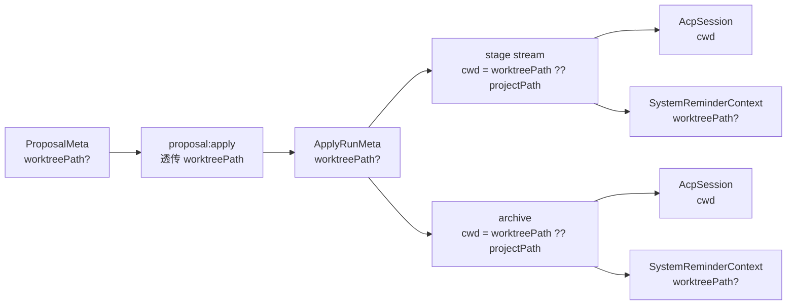
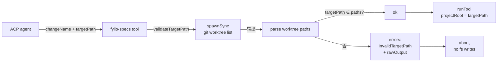

## Context

FylloCode 当前所有 ACP session（chat / apply / archive）都用 `cwd: projectPath` 启动（`electron/main/ipc/chat.ts:133`、`electron/main/ipc/proposal-apply.ts:131,334`），即主仓库根目录。OpenSpec change artifacts 通过 `fyllo-specs` MCP 落到 `<projectPath>/openspec/changes/<changeName>/`。fyllo-specs MCP 子进程通过 `bundled-mcp-servers.ts:33` 注入 `FYLLO_PROJECT_PATH=<projectPath>`，工具内部用 `resolveProjectRoot()` 拿到该值作为唯一 projectRoot 来源。

本次（P1）只为后续 multi-worktree 工作流（P2: chat 编排建 worktree、P3: list 双源扫描、P4: archive 编排收尾）打地基：

- 主进程 ApplyRunMeta / ProposalMeta 增加 `worktreePath?` 字段（值始终为 `undefined`）。
- ACP cwd 改为 `runMeta.worktreePath ?? projectPath` —— 字段为空时行为完全等价于现状。
- MCP 工具入参 `targetPath` 必填，工具不再用 env fallback；P1 阶段 agent 仍传 `$FYLLO_PROJECT_PATH`（即主仓库），到 P2 切换为 worktreePath。

P1 不引入任何用户可见行为变化，目的是让 P2/P3/P4 能基于这套契约逐步增量上线，避免一次性大改。

**关键事实**

- ACP session cwd 在 `connection.newSession({ cwd, mcpServers })` 时锁定，整个 session 不可改。
- MCP 子进程通过 stdio 启动，父进程通过 env 注入上下文（参见 `bundled-mcp-servers.ts`）。
- fyllo-specs 当前 4 个 tool 中 `explore` / `apply-change` / `archive-change` 入参不含 `targetPath`，`create-proposal` 同样没有；都靠 `resolveProjectRoot()` 读 `FYLLO_PROJECT_PATH`。
- `ProposalMeta` / `ApplyRunMeta` 两个类型在 `shared/types/proposal.ts` 定义；当前没有 worktree 相关字段。
- 现有 `loadApplyRunMeta` 反序列化使用 `JSON.parse`，对未知字段忽略；新增可选字段时旧文件加载不会出错。

## Goals / Non-Goals

**Goals**

- 主进程具备承载 worktreePath 的数据契约（ProposalMeta / ApplyRunMeta / SystemReminderContext）。
- ACP cwd 取值具备 worktreePath fallback 路径，且当字段为空时行为完全等价于改造前。
- fyllo-specs MCP 4 个 tool 入参 `targetPath` 必填，校验路径合法性，工具内部 projectRoot 取自该参数；FYLLO_PROJECT_PATH 仅用于合法性校验。
- 单测覆盖关键分支：旧 run.json 兼容、targetPath 各类校验场景、cwd fallback。

**Non-Goals**

- 不实现 git worktree 创建、移动、删除等任何 git 操作（P2/P4）。
- 不修改 system-reminder 模板正文（chat.txt / apply.txt / archive.txt 的 worktree 编排段落留给 P2/P4）。
- 不修改 `proposal:list` 扫描逻辑（双源扫描 + 卡片标记留给 P3）。
- 不修改前端任何卡片显示（P3）。
- 不引入新 capability spec —— `proposal-multi-worktree` 这份新 spec 留给 P2 提交。

## Decisions

### D1：targetPath 设为必填，FYLLO_PROJECT_PATH 退为标识

**选择**：fyllo-specs MCP 4 个 tool 入参全部把 `targetPath: string` 设为必填；`FYLLO_PROJECT_PATH` env 仅用于：① 校验 targetPath 必须是该 main repo 的合法 worktree（通过 `git -C $FYLLO_PROJECT_PATH worktree list --porcelain` 解析）；② 后续 P2/P4 阶段定位 main repo（如维护 .gitignore）。

**理由**：

- MCP 没有"老调用方"——所有调用方就是 ACP agent，每次会话开始时通过 tool schema 看到当前形态；可选会让 agent 在缺省语义和显式传值之间犹豫，徒增不确定性。
- 必填强制让 agent 时刻意识到"此次操作针对哪个工作目录"，对多 change 同 chat 场景尤其重要（虽然 P1 阶段还无法发挥这个作用，但契约要先到位）。
- 校验 `targetPath ∈ git -C $FYLLO_PROJECT_PATH worktree list` 防止 agent 把 artifacts 写到任意目录。

**P1 阶段的过渡形态**：agent 在 P1 上线后仍只看到主仓库一个 worktree，所以 `targetPath` 始终传 `$FYLLO_PROJECT_PATH`（main repo 自身在 `worktree list` 输出中也算一条）。P2 上线后 chat.txt 编排引导 agent 切换为 worktreePath。

### D2：cwd 用 nullish-coalescing fallback，不引入分支配置

**选择**：`proposal:stageStream` 与 `proposal:archive` 创建 `AcpSession` 时 cwd 取值改为 `runMeta.worktreePath ?? projectPath`。`projectPath` 字段（即主仓库根）保持原样传入，用于持久化目录计算与 reminderContext。

**理由**：

- 单一表达式 + `??` 兜底，行为分支极简；P1 阶段 worktreePath 始终 undefined，等价于现状。
- 不引入 feature flag 或独立配置项：worktreePath 字段值就是开关。
- 不修改 `chat.ts` 的 cwd（chat session 永远绑定主仓库，这是 multi-worktree 工作流的整体决策；P1 不动 chat）。

### D3：reminderContext 增加 worktreePath（值可为 undefined）

**选择**：`SystemReminderContext` 类型增加可选字段 `worktreePath?: string`；stage stream / archive handler 在构造 reminderContext 时把 `runMeta.worktreePath` 透传进来。P1 模板（apply.txt / archive.txt）正文不引用该字段（不渲染、不显示），仅做契约预留。

**理由**：

- system-reminder 模板的字段消费由 P2/P4 完成；P1 只补字段。
- 提前到位避免 P2/P4 上线时同时改两边导致 surface 增大。

### D4：ApplyRunMeta / ProposalMeta 字段为可选，向后兼容

**选择**：`ApplyRunMeta.worktreePath?` 与 `ProposalMeta.worktreePath?` 都为可选字段。

**反序列化兼容**：`loadApplyRunMeta` 当前直接 `JSON.parse` 已读 ApplyRunMeta，未知字段忽略；缺字段反序列化为 `undefined`。无需迁移脚本。

**序列化**：`JSON.stringify` 对 `undefined` 字段省略，旧 run.json 升级后写盘看不到 `worktreePath: null` 噪声。

#### 选项对比

| 方案                 | 优点                          | 痛点                                           |
| -------------------- | ----------------------------- | ---------------------------------------------- |
| 可选字段（本设计）   | 旧文件零迁移；JSON 序列化干净 | 类型上多一层 `?:`                              |
| 必填默认空串         | 类型语义稍简单                | 旧文件加载需要兜底逻辑；空串与"主仓库"语义不同 |
| 引入新 v2 元数据文件 | 强类型版本控制                | 工程复杂度高于本次范围                         |

### D5：targetPath 校验通过 spawnSync 调起 git

**选择**：在 `mcp-servers/fyllo-specs/src/utils/project-root.ts` 新增 `validateTargetPath(targetPath: string): { ok: boolean; rawOutput?: string; error?: string }`，内部使用 Node `child_process.spawnSync("git", ["-C", FYLLO_PROJECT_PATH, "worktree", "list", "--porcelain"])` 执行并解析输出。

**输出解析**：`worktree list --porcelain` 每条记录由空行分隔，每个 worktree 的第一行格式为 `worktree <absolute-path>`。提取所有此类路径，比较 `path.resolve(targetPath)` 是否在集合中。

**non-git 项目兜底**：当 `<mainRepo>/.git` 不存在时，spawn `git worktree list` 会以非 0 退出。`validateTargetPath` 在 spawn 失败时回退到"`targetPath === FYLLO_PROJECT_PATH` 即合法"的旧规则。这保证 non-git 项目（`template: "empty"`）行为完全不变。

#### 选项对比

| 方案                          | 优点                          | 痛点                                   |
| ----------------------------- | ----------------------------- | -------------------------------------- |
| spawnSync git（本设计）       | 无新依赖；与系统 git 行为一致 | 子进程开销（每次 MCP 调用 1 次 spawn） |
| simple-git 库                 | 高级 API                      | 新依赖；P1 阶段还用不到丰富 API        |
| 直接读 `.git/worktrees/` 目录 | 无 spawn                      | 解析 git 内部数据格式不稳定            |

`spawnSync` 开销在 MCP 工具调用层面忽略不计（agent 一次调用本来就走 stdio + JSON 解析）。

### D6：worktreePath 字段在 P1 阶段始终为 undefined

**选择**：P1 落地后，`apply-run-service.ts` 创建 run 时虽然从 `ProposalMeta.worktreePath` 透传，但 `ProposalMeta` 自身的 worktreePath 在 P3（list 双源扫描）之前永远是 `undefined`，所以 ApplyRunMeta 实际写入也是 `undefined`。stage stream / archive 的 cwd fallback 始终命中 `projectPath`，行为等价于改造前。

**理由**：契约上字段就位，但来源端尚未启用，避免在 P3 完成前出现"半就位"的混乱状态。

## Architecture

### 数据流

P1 阶段所有 `worktreePath?` 字段值均为 `undefined`；cwd fallback 命中 `projectPath`；模板不渲染 worktreePath。

### MCP tool 入参形态

### 路径口径

| 概念                      | P1 阶段值                                                                         |
| ------------------------- | --------------------------------------------------------------------------------- |
| `mainRepo`                | `FYLLO_PROJECT_PATH` env，子进程注入                                              |
| `targetPath`              | agent 传入；P1 阶段始终等于 `mainRepo`                                            |
| `worktreePath` (类型字段) | 始终 `undefined`                                                                  |
| ACP cwd                   | `runMeta.worktreePath ?? projectPath`，fallback 到 `projectPath`（即 `mainRepo`） |

所有路径在比较前 `path.resolve` 规范化（剥离 trailing slash、解析符号链接）。

## Risks / Trade-offs

- **MCP 工具入参 break**（中）：`targetPath` 必填使工具描述与行为发生破坏性变化。
  - 缓解：唯一调用方是同进程 ACP agent；agent 在 P1 上线后第一次调工具时会读到新 schema 并按 schema 调用；不会出现外部"老调用方"残留问题。
  - 验证：FylloCode 启动后立即跑一次 chat → create-proposal → apply → archive 流程，确认 agent 正确传 `targetPath: <mainRepo>`。

- **spawnSync git 在某些环境慢**（低）：MCP 每次调工具会触发一次 git spawn。
  - 缓解：spawn 开销在 ACP 工具调用整体耗时中可忽略；不缓存（避免缓存与实际 worktree 状态错位的隐患）。

- **non-git 项目误判**（低）：当 `<mainRepo>/.git` 不存在，spawn 会非 0 退出。
  - 缓解：D5 已说明 fallback 规则——spawn 失败时退化为 `targetPath === FYLLO_PROJECT_PATH` 即合法，等价于现状。
  - 单测覆盖：`tools/__tests__/explore.spec.ts` 等加分支测 spawn 失败场景。

- **类型字段误用**（低）：未来 P3 上线后，主进程代码可能忘记把 worktreePath 透传。
  - 缓解：本次单测在 `apply-run-service.ts` 加用例：从 ProposalMeta.worktreePath 透传到 ApplyRunMeta.worktreePath；以及 stage stream cwd 的 fallback 测试。

## Migration Plan

1. **shared/types/proposal.ts**：增加 `worktreePath?: string` 到 ProposalMeta、ApplyRunMeta。typecheck 通过。
2. **mcp-servers/fyllo-specs**：在 `utils/project-root.ts` 新增 `validateTargetPath`；4 个 tool 的 input schema 增加必填 `targetPath`；handler 内部 `projectRoot = path.resolve(input.targetPath)`，去掉 `resolveProjectRoot()` 的 fallback 调用。
3. **electron/main/services/proposal/apply-run-service.ts**：创建 ApplyRunMeta 时透传 `proposalMeta.worktreePath`。
4. **electron/main/ipc/proposal-apply.ts**：stage stream 与 archive 的 `cwd: projectPath` 改成 `cwd: runMeta.worktreePath ?? projectPath`；reminderContext 增加 `worktreePath: runMeta.worktreePath` 字段。
5. **electron/main/services/chat/system-reminder/types.ts**：`SystemReminderContext.worktreePath?` 字段加入。
6. 单测/集成测试覆盖：旧 run.json 加载、targetPath 各类校验场景、cwd fallback、ProposalMeta 序列化。
7. dogfood：在 FylloCode 仓库本地跑 chat → create-proposal → apply → archive 一次，确认行为零回归。

**回滚**：把 `runMeta.worktreePath ?? projectPath` 改回 `projectPath`；MCP 工具 `targetPath` 改为可选并 fallback `resolveProjectRoot()`。代码物理改动可控。

## Open Questions

无。所有决策在本设计内已锁定。
