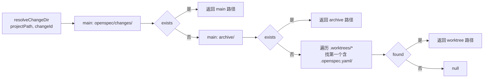

## Context

P1 已经在 `shared/types/proposal.ts` 给 `ProposalMeta` 加了 `worktreePath?: string` 字段、在 `apply-run-service` 给 `ApplyRunMeta.worktreePath` 加了透传逻辑、在 `proposal-apply.ts` 给 stage stream / archive ACP session 加了 cwd fallback。但所有这些字段在 P1 阶段值都是 `undefined`，因为没有"来源端"——`readProposalFiles` 仍只扫主仓库的 `openspec/changes/`。

P2 让 chat 阶段的 agent 在 `<projectPath>/.worktrees/<changeName>/` 创建 worktree 并把 OpenSpec change 写在那里，这样磁盘上**确实**已经有 worktree 来源的 change，但列表/详情页都看不到。

P3 让 `readProposalFiles` 能扫到这些 worktree 来源的 change，给每条 meta 写上 `worktreePath`，激活 P1 已部署但未启用的整条数据通路：列表显示 → 详情页能 read → 点 apply → ApplyRunMeta.worktreePath 自动写入 → stage stream cwd 落到 worktree。

**关键事实**

- `readProposalFiles(projectPath)` 当前实现：扫 `<projectPath>/openspec/changes/` 与 `<projectPath>/openspec/changes/archive/`；`resolveChangeDir` 同样只看这两处。
- ProposalMeta 字段含 `id`、`title`、`status`、`why`、`totalTasks`、`doneTasks`、`hasDesign`、`date`、`worktreePath?`（最后一个由 P1 引入）。
- 列表页 `frontend/src/pages/proposal/index.vue` 当前已用 `<UBadge>` 显示 status，可以在同一行右侧追加 worktree 标记。
- 主仓库 `archive/<date>-<id>/` 与 worktree `<wt>/openspec/changes/<id>/` 在 changeId 上**不会冲突**，因为前者带日期前缀（`stripArchivePrefix` 用正则 `/^\d{4}-\d{2}-\d{2}-/` 识别）。

## Goals / Non-Goals

**Goals**

- `readProposalFiles` 同时扫主仓库与 `<projectPath>/.worktrees/*/openspec/changes/`；worktree 来源 meta 携带 `worktreePath`；同名 changeId 双源出现时 worktree 优先。
- `resolveChangeDir` 在主仓库找不到时按 worktree 顺序探查；返回的目录路径用于下游 `proposal:read` 等 API 直接读取 worktree 内的 artifacts。
- 列表卡片在 `worktreePath` 非空时展示视觉标记 + tooltip。
- 该通路启用后，apply 创建 run 时 worktreePath 会自动从 ProposalMeta 透传到 ApplyRunMeta（P1 通路天然生效）。

**Non-Goals**

- 不修改 MCP `create-proposal` 工具行为（worktree add 仍由 agent 在 P2 chat reminder 引导下完成）。
- 不修改 archive 编排逻辑（P4）。
- 不为 `<projectPath>/.worktrees/*/openspec/changes/archive/` 路径下的归档去扫描——archive 完成时 worktree 会被删除（P4 编排），所以这条路径上不会有持久 archived change。
- 不引入"清理孤儿 worktree"的 UI 入口；列表里看到一个孤儿 worktree（已 archive 但 worktree 没被 remove）属于 P4 失败兜底场景，由用户用原生 git 命令处理。
- 不改 ApplyRunMeta 持久化逻辑（P1 已就绪）；不改 stage stream / archive ACP cwd 取值逻辑（P1 已就绪）。

## Decisions

### D1：扫描顺序与目录构造

**选择**：

```ts
async function readProposalFiles(projectPath: string): Promise<ProposalMeta[]> {
  const fromMain = await readActiveDir(join(projectPath, "openspec", "changes"), undefined);
  const fromArchive = await readArchiveDir(join(projectPath, "openspec", "changes", "archive"));
  const fromWorktrees = await readWorktreesActiveDirs(join(projectPath, ".worktrees"));
  return dedupeWorktreePriority([...fromMain, ...fromArchive, ...fromWorktrees]);
}
```

具体：

- `readActiveDir(dir, worktreePath)`：扫 `<dir>/*/`，每个子目录读 `.openspec.yaml`；返回的 ProposalMeta 把 `worktreePath` 设为传入参数。
- `readArchiveDir(dir)`：扫 `<dir>/*/`，仅生产 status 为 `archived` 的 ProposalMeta（来源主仓库）；`worktreePath: undefined`。
- `readWorktreesActiveDirs(worktreesRoot)`：先 `fs.readdir(worktreesRoot)`（不存在则返空数组），对每个 worktree 子目录调 `readActiveDir(<wt>/openspec/changes, <wt 绝对路径>)`。**不扫 worktree 内的 archive 路径**——archive 完成时 worktree 被删除，那条路径上不会有持久数据。

**理由**：扫 worktree 的 active dir 已经覆盖所有 worktree 来源的 change；archive 时 worktree 由 P4 编排清理，不会有孤儿 archived 在 worktree 内。

### D2：去重规则——worktree 优先

**选择**：合并三段结果时用 `Map<changeId, ProposalMeta>`，按"main active → main archive → worktree"顺序写入；后写入覆盖先写入。

**关键观察**：

- main active 的 changeId 不带日期前缀（如 `foo`）。
- main archive 的 changeId 带日期前缀（如 `2026-05-19-foo`）。
- worktree 的 changeId 不带日期前缀（如 `foo`）。

所以**main active 与 worktree 的 changeId 重合**才会触发去重，main archive 不参与去重。

**冲突场景**：

| 状态                               | main active 是否有 `foo` | worktree `foo` 是否存在          | 结果                                                                                                                 |
| ---------------------------------- | ------------------------ | -------------------------------- | -------------------------------------------------------------------------------------------------------------------- |
| chat 刚 propose                    | ✗                        | ✓                                | 列表显示 worktree `foo`                                                                                              |
| archive 完成、worktree 还没 remove | ✗（已 merge 到 archive） | ✓（编排断在 worktree-remove 前） | 列表显示 worktree `foo`（status 已是 archived）+ main archive 的 `2026-05-19-foo`。changeId 不同，不冲突，两条都展示 |
| 真正发生冲突的异常状态             | ✓                        | ✓                                | 取 worktree 那条；main active 那条被覆盖                                                                             |

第二种场景"用户在列表看到两条相关 change"虽然冗余，但都是真实状态，不应隐藏；用户能从 status / changeId 区分（前者 active 名 + worktree 标记 + status archived，后者带日期前缀 + 无 worktree 标记 + status archived）。

#### 选项对比

| 方案                    | 优点                         | 痛点                                                        |
| ----------------------- | ---------------------------- | ----------------------------------------------------------- |
| worktree 优先（本设计） | 实时反映 worktree 内最新状态 | 异常状态下隐藏 main active 那一条；但异常状态本来就不该出现 |
| main 优先               | 主仓库为权威                 | worktree 的 active 状态被屏蔽，与 P3 目标冲突               |
| 不去重，并列展示        | 显式                         | 同名 changeId 在 UI 上视觉混乱                              |

### D3：`resolveChangeDir` 探查顺序

**选择**：

```
order:
  1. <projectPath>/openspec/changes/<id>
  2. <projectPath>/openspec/changes/archive/<id>
  3. <projectPath>/.worktrees/*/openspec/changes/<id>
找到第一个含 .openspec.yaml 的目录即返回。
```

**理由**：

- 1 优先于 3：保证 main active 与 worktree 同名时，下游接口默认拿到 main 那个；与 D2 列表去重的"worktree 优先"并不矛盾——`resolveChangeDir` 是被 `proposal:read changeId` 等单 change 操作调用，调用方传入 `changeId` 就是表达"我要看 main active 的"还是"worktree 的"已经在 changeId 不同时被表达。但实际上 D2 已经说明 main active 与 worktree 同名只在异常状态下出现；正常情况下 main active 与 worktree 不会有同名，因此优先级 1 vs 3 实际不冲突。

**例外**：详情页路由 `/proposal/<id>` 当前不带 worktree 信息。如果同名异常状态出现，详情页打开的是 main active 那一份。这是已知边界，不在本能力范围内修补——异常状态本来就不该出现。

### D4：worktree 标记的 UI 形式

**选择**：在卡片右上角 status badge 旁边追加一个小图标 + 文案 "worktree"，鼠标悬浮显示完整 worktreePath（用 `title=` 原生属性即可，不引入 Tooltip 组件以避免大改）。

```vue
<span
  v-if="proposal.worktreePath"
  class="inline-flex items-center gap-1 text-xs text-muted shrink-0 mt-0.5"
  :title="proposal.worktreePath"
>
  <UIcon name="i-lucide-git-branch" class="w-3 h-3" />
  worktree
</span>
```

**理由**：

- `i-lucide-git-branch` 在视觉上贴近 worktree 概念。
- `title=` 是原生 HTML 属性，零依赖；hover 后用户能看到完整路径。
- 文案 "worktree" 让用户理解这条 change 在哪一类目录里。

**否决**：

- 单纯放 icon 不写文案——首次接触概念的用户看不出含义。
- 用 UTooltip 包裹——@nuxt/ui 4 的 Tooltip 组件需要包一层 trigger，对单条卡片是过度封装。

### D5：扫描失败/路径不存在的鲁棒性

**选择**：每段扫描独立 try/catch，任一段失败都返回空数组而不终止整体。原 `readProposalFiles` 已有外层 try/catch（catch 全部异常返回 `[]`），P3 不收紧这个语义；新增的 worktree 扫描走同样的失败兜底。

**理由**：worktree 路径不存在（用户从来没建过 worktree）是常见情况；不应让 list 整体失败。

## Architecture

### 扫描流程

```mermaid
flowchart TD
  R[readProposalFiles<br/>projectPath] --> M["扫主仓库<br/>openspec/changes/*"]
  R --> A["扫主仓库<br/>openspec/changes/archive/*"]
  R --> W["列出 .worktrees/*"]
  W --> WL{worktrees 路径存在?}
  WL -->|否| EMPTY[返空数组]
  WL -->|是| WS["对每个 worktree<br/>扫 openspec/changes/*"]
  WS --> WC[worktree 来源 metas<br/>带 worktreePath]
  M --> MERGE[Map dedupe<br/>main → archive → worktree]
  A --> MERGE
  WC --> MERGE
  EMPTY --> MERGE
  MERGE --> SORT[按 date 倒序]
  SORT --> OUT[ProposalMeta[]]
```

### `resolveChangeDir` 探查



## Risks / Trade-offs

- **同名去重的极端冲突**（低）：main active 与 worktree 同时存在 `foo`（异常状态）时 worktree 覆盖 main active。详情页路由不带 worktree 信息，会打开 main active 那份。
  - 缓解：异常状态本来就不该出现；P4 archive 编排可靠后此场景几乎消失。
- **worktree 数量过多导致扫描慢**（低）：worktree 数量预期 < 10。
  - 缓解：不引入缓存，保持实现简单。
- **archive 完成、worktree 未删时列表出现两行**（低）：用户可能困惑。
  - 缓解：worktree 那条带 worktree 标记 + status archived；main archive 那条 changeId 含日期前缀。两条状态都是真实磁盘状态，不应隐藏。

## Migration Plan

1. 修改 `electron/main/domain/proposal/openspec-reader.ts`：抽出 `readActiveDir` / `readArchiveDir` 内部辅助；新增 `readWorktreesActiveDirs`；更新 `readProposalFiles` 主流程；更新 `resolveChangeDir` 探查 worktree 路径。
2. 在 `electron/main/domain/proposal/__tests__/`（如不存在则建）创建 `openspec-reader.spec.ts`，覆盖：worktrees 不存在 / 单 worktree 单 change / 多 worktree / 同名 changeId 去重以 worktree 为准 / archive 路径 changeId 含日期前缀不参与去重 / 路径规范化（trailing slash 等）。
3. 修改 `frontend/src/pages/proposal/index.vue` 卡片模板，加 worktree 标记。
4. dogfood：在 P2 完成后，跑一次 chat → propose 让 worktree 中产生一份 change；进入列表页确认显示 + 标记；进入详情页确认能正确读 worktree 内 artifacts；触发 apply 确认 ApplyRunMeta.worktreePath 写入。

**回滚**：移除 `readProposalFiles` 中 worktree 扫描分支；移除 `resolveChangeDir` 中 worktree 探查；前端卡片标记由 `v-if` 守卫，扫描回滚后字段为空，标记自然不显示。

## Open Questions

无。
