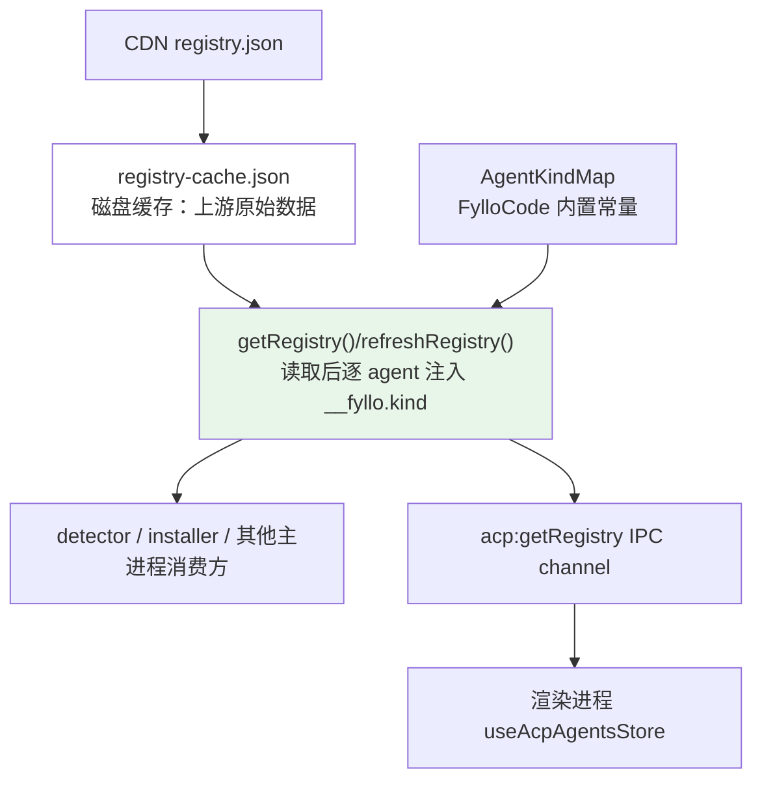

## Context

ACP registry 由 `cdn.agentclientprotocol.com` 维护，schema 由协议方治理；FylloCode 是消费方。当前问题不是检测能力缺陷，而是用户视角下 `claude-acp` / `codex-acp`（独立适配层）与 `pi-acp`（桥接本地 CLI）行为差异未在 UI 层显现，造成「我装了 Claude Code 为什么没识别」的 bug 假象与「装好 pi-acp 为什么用不起来」的隐性失败。

调研事实：

- `electron/main/infra/storage/acp-registry-cache.ts:84-103` 的 `getRegistry()` 是 main 进程读取 registry 的唯一入口，IPC channel `acp:getRegistry` 与所有内部消费方都从这里取数据；磁盘缓存 `getDataSubPath('acp')/registry-cache.json` 结构为 `{ fetchedAt, data: AcpRegistry }`，TTL 24 小时
- `shared/types/acp-agent.ts:28-43` 定义 `AcpAgentEntry` 与 `AcpRegistry`，目前**没有**任何"adapter / bridge / native"维度字段
- `electron/main/domain/acp/detector.ts:318-344` 仅检测 adapter 包自身（npx / uvx / binary），不探测底层 CLI；这是有意为之 —— `pi-acp` 已自带本地 `pi` 检测，运行时通过 `RequestError.internalError` 反馈到 ACP client
- 卡片渲染入口三处：`frontend/src/components/settings/AgentCard.vue`、`frontend/src/components/chat/empty/AgentPickerCard.vue`、`frontend/src/components/chat/empty/InstalledAgentTile.vue`（其中 `InstalledAgentTile` 是 Chat 空态首屏的极简切换 tile，本次提案 UX 评审决定**不**为它挂分类图标，理由见 Decision 5）

约束：

- 不能等上游 schema 变更，必须在 FylloCode 自己一层补元数据
- 数据流必须保持「唯一出口」原则，避免 detector / IPC / 渲染各自维护一份分类表导致漂移
- 不修改 detector / 安装流程 / IPC 形状，把范围严格控制在「分类标识 + UI 表达」

## Goals / Non-Goals

**Goals:**

- 在 FylloCode 主进程到渲染进程的 registry 数据流中，一致地附带 agent 分类信息（`native` / `adapter` / `bridge`）
- 用户在卡片上能一眼区分三类 agent，并通过 tooltip 理解装完是否够用
- 三类 agent 的展示与文案保持通用，不写死具体 agent 名字，便于将来扩充
- 缓存语义保持纯净：磁盘 snapshot 仍是上游原始数据，FylloCode 自有元数据只在出口注入

**Non-Goals:**

- 不在本次扩展 detector：不对 `claude` / `codex` / `pi` 等底层 CLI 做存在性检测
- 不修改 `AcpAgentStatus` 二态语义（仍是 `installed: boolean`）
- 不引入安装动作上的差异（adapter / bridge 的安装入口与按钮文字保持一致）
- 不调整 IPC channel 形状或新增分类专用 channel
- 不处理 auth / API key 配置 UI（这是 ACP 协议层议题，建立连接后协商）

## Decisions

### 1. 字段载体：`__fyllo: { kind }` 命名空间，而非 `__type` 单字段

```ts
export type AcpAgentKind = "native" | "adapter" | "bridge";

export interface AcpFylloMeta {
  kind: AcpAgentKind;
}

export interface AcpAgentEntry {
  // ...原有字段
  __fyllo?: AcpFylloMeta;
}
```

**理由**：

- 双下划线前缀避让上游可能新增的同名字段（如 `type`），与 dunder 命名约定一致
- 命名空间结构便于未来追加 `installHint`、`docsUrl`、`localCliRequired` 等 FylloCode 自有元数据，不让顶层越来越散
- 类型上让"上游字段"和"FylloCode 字段"在结构上分离，类型断言成本低

**备选**：`__type: AgentKind`、`fylloMeta: { kind }`、扩展类型 `EnrichedAgent { registry, classification }`。前两者扩展性差，后者要求所有消费方走包装类型，改动面比直接挂在 entry 上大很多。

### 2. 分类来源：FylloCode 源码内置 `AgentKindMap`，按 `agent.id` 索引

存放位置：`electron/main/domain/acp/agent-kind-map.ts`（domain 层常量），数据形如：

```ts
const ADAPTER_AGENT_IDS = new Set(["claude-acp", "codex-acp", "amp-acp"]);
const BRIDGE_AGENT_IDS = new Set(["pi-acp"]);

export function resolveAgentKind(agentId: string): AcpAgentKind {
  if (ADAPTER_AGENT_IDS.has(agentId)) return "adapter";
  if (BRIDGE_AGENT_IDS.has(agentId)) return "bridge";
  return "native";
}
```

**理由**：

- 当前已知 bridge 类只有 `pi-acp` 一个，频率低；用源码常量比走配置文件更轻
- 改动立即对所有消费方生效，无需等 24h TTL

**判定标准**：在 Chat 阶段对 36 个 registry 条目的初次扫描中，`adapter` 与 `native` 的边界并不只是"自带完整实现"。例如 `glm-acp-agent` 同样自带完整实现、纯 HTTP 调远端 API，但 GLM 没有官方 CLI 产品形态，用户也不会"以为我装了某个东西就该被识别"。因此分类的关键是**用户心智锚点**：

> **adapter 判定准则**：当且仅当存在一个**用户视角下的对应官方 Agent / CLI**（足以让用户产生「我装了它，FylloCode 是不是该识别」预期），且该 ACP 包**自带完整实现、不 spawn 该 CLI 子进程**时，归为 `adapter`。
>
> 没有这种心智锚点的纯 HTTP 实现（如 `glm-acp-agent`、`agoragentic-acp`）归为 `native`，避免引入"共享配置"这类对用户不成立的提示。

> **bridge 判定准则**：运行时通过 `spawn` 等方式调用本地命令行工具完成工作，依赖该 CLI 已安装。

这三类的定义、判定准则与已知归类示例 SHALL 录入 `guidelines/Domain.md`，作为常驻 source of truth；本次提案归档后，design.md 不再可达，但产品词汇会留在 guidelines 里指导后续判断。

**风险**：未来新增 bridge 但忘了同步映射 → 默标 `native` → 用户预期"装完够用"，回到原问题。

**缓解**：纪律落入 `guidelines/Domain.md`，并在 `agent-kind-map.ts` 顶部注释中指向该 guideline。

### 3. 注入时机：`acp-registry-cache.ts` 出口注入，不写入磁盘缓存



**理由**：

- 缓存职责单一：磁盘文件仍是上游 snapshot，未来上游 schema 加字段不需要回头清缓存
- 改 `AgentKindMap` 立即生效，不用等 TTL 或手动刷新
- 唯一出口：所有消费方都从 `getRegistry()` 拿到已注入分类的数据，不可能漂移

**实现要点**：注入应在 `getRegistry()` 与 `refreshRegistry()` 返回前一处完成，避免每个调用方重复合并；可抽出私有 helper `enrichRegistry(data: AcpRegistry): AcpRegistry`，对 `data.agents` 做不可变映射，返回新对象。

**备选**：在写入磁盘前注入 → 缓存语义被污染；在前端 store 中合并 → 多处合并、容易遗漏 IPC 之外的内部消费方。两者都被否决。

### 4. 兜底策略：未匹配 → `native`，UI 不显示图标

「未匹配」时分类记为 `native`，符合 ACP registry 中绝大多数 agent 的预期形态。

UI 表达上 `native` **不显示分类图标**：

- 留白即默认，避免给所有卡片堆视觉噪音
- 增加图标只在"有话要说"时出现：adapter 提醒"自带实现"、bridge 提醒"还要装别的"

### 5. UI 形态：图标 + tooltip，在 `AgentCard` 与 `AgentPickerCard` 的名称行渲染

| 分类      | 图标              | Tooltip 文案                                           |
| --------- | ----------------- | ------------------------------------------------------ |
| `native`  | （无）            | （无）                                                 |
| `adapter` | `i-lucide-layers` | 适配器 · 自带完整实现，可与已安装的对应 Agent 共享配置 |
| `bridge`  | `i-lucide-cable`  | 桥接器 · 与 Agent 桥接打通，需要先安装对应的 Agent     |

**理由**：

- 图标 + tooltip 是两处卡片共用的最小公约数，比文字徽章更省卡片空间
- 文案通用化：不写"无需本地 claude / codex"或"需要本地 pi"等具体 CLI 名，新增同类 agent 不必改文案
- 图标差异度：`layers`（独立的一层）vs `cable`（连接到外部某个东西），用户一眼能区分

**`InstalledAgentTile` 不挂分类图标**：tile 是 Chat 空态下的极简形态，仅图标 + 名称两行；右上角已被「选中态对勾角标」占用，再叠分类图标会形成视觉冲突，且 tile 主要是 agent 切换入口而非引导/教育载体。Chat 空态的分类引导由用户进入 `AgentPickerModal` 时由 `AgentPickerCard` 承担；tile 选中后用户后续会进入设置页或 modal，那里能完整看到分类徽章。

**实现要点**：抽出共用组件 `AgentKindBadge.vue`（或纯函数式插槽），输入 `kind`，输出图标 + UTooltip 包装。`AgentCard` 与 `AgentPickerCard` 都引用同一组件，避免文案两抄。

### 6. 产品词汇与判定标准的 source of truth：`guidelines/Domain.md`

按 `mcp__fyllo_skills__guidelines` 的 write 契约，FylloCode 仓库的产品词汇、业务规则、状态转换、不变量应放在 `guidelines/Domain.md` 中（仓库当前尚未存在）。本次提案将此文件作为 native / adapter / bridge 三类 agent 词条与判定准则的常驻 source of truth：

- 录入三类 agent 的定义与判定准则（含「用户心智锚点」准则，原文见 Decision 2）
- 列出当前已知归类示例：
  - `adapter`: `claude-acp`、`codex-acp`、`amp-acp`
  - `bridge`: `pi-acp`
  - `native`（边界示例）：`glm-acp-agent`（GLM 无官方 CLI）、`agoragentic-acp`（marketplace SaaS，无对应 CLI 产品）
- 明确纪律：**新增或重新分类 ACP agent 时，必须双向同步 `guidelines/Domain.md` 与 `electron/main/domain/acp/agent-kind-map.ts`**

理由：design.md 在 change 归档后不再被消费，guidelines 才是常驻在仓库上的判断依据；下一次有人评估 "新出的 X 算 adapter 还是 native" 时，应该直接读 `Domain.md` 即可决断，而不是翻历史 change。

## Risks / Trade-offs

- **AgentKindMap 漂移风险** → 纪律落入 `guidelines/Domain.md`，并在 `agent-kind-map.ts` 顶部注释中指向该 guideline；评审新 agent 归类时直接对照 `Domain.md` 判定准则
- **adapter 错标 native（装完够用，但用户错过共享配置提示）** → 影响有限，仅是少一条引导文案，不影响功能
- **bridge 错标 native（装完不够用）** → 用户照样会在首次发送消息时看到 `pi-acp` 抛出的内置错误（`PiRpcSpawnError` → `RequestError.internalError`）；这是兜底而非首选体验，因此前置纪律仍是关键
- **`__fyllo` 命名空间未来扩展引入复杂度** → 当前只放 `kind`，扩展时再评估，不预先添加无用字段
- **两处卡片 UI 一致性** → 通过抽出 `AgentKindBadge` 共用组件强制收敛，避免文案散落

## Migration Plan

1. 类型与常量先落（`shared/types/acp-agent.ts`、`electron/main/domain/acp/agent-kind-map.ts`）
2. 在 `acp-registry-cache.ts` 出口注入；为该模块补单元测试覆盖三种 kind 的注入结果
3. 抽出 `AgentKindBadge.vue` 组件
4. 两处卡片（`AgentCard`、`AgentPickerCard`）接入 `AgentKindBadge`；`InstalledAgentTile` 保持不变
5. 新建 `guidelines/Domain.md`（包含三类定义、判定准则、已知归类、同步纪律），并在 root `CLAUDE.md` 文档归类段追加索引

无数据迁移负担：磁盘缓存格式未变；旧缓存被读出后注入 `__fyllo` 即可使用。

## Open Questions

无 —— 字段载体、分类来源、注入时机、兜底策略、UI 形态与文案在 Chat 阶段已全部对齐。
