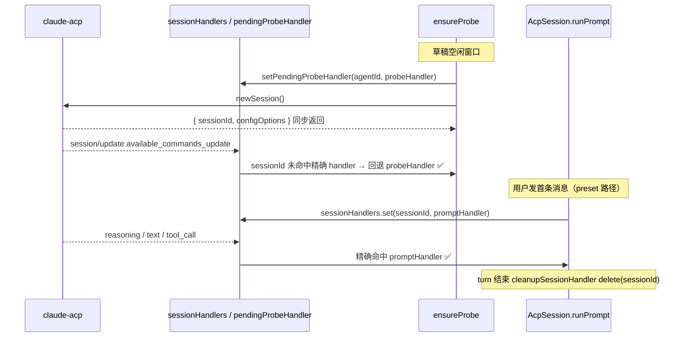

## Context

新建会话首条消息时 slash command 组件不展示。根因已定位（详见 proposal.md）：

- 草稿期 `session-probe-service.ts#ensureProbe` 调用 `connection.newSession()` 后**从不注册 `sessionHandler`**。
- ACP agent（claude-acp）在 `newSession` 响应返回**之后**用 `setTimeout(() => sendAvailableCommandsUpdate(sessionId), 0)` 异步推送 `available_commands_update`（`session/update` notification，源码已确认）。
- `acp-process-pool.ts` 的 `sessionUpdate` 路由按 `sessionId` 查 handler，查不到则静默丢弃（`acp-process-pool.ts:136-139`）。该 notification 正好落在「probe 拿到 sessionId 但尚未注册任何 handler」的窗口，被丢弃。

对照证据：`configOptions` 是 `newSession` 响应的**同步返回值**（`session-probe-service.ts:98` 直接从 `response.configOptions` 取），所以配置选项能显示；`available_commands_update` 走异步 notification 通路被丢，所以命令不显示。同一个 `newSession`，两个字段命运不同，精确印证根因。

现有 `configOptions` 已有一条跑通的全链路：`probe newSession 返回 → ProbeEntry.configOptions → toProbeSnapshot → SessionProbeBus → 前端 draftProbe → 首条消息 carryProbe → createSession 落盘 → chat:stream:message takeFor patchSessionMeta`。本设计让 `availableCommands` 完全镜像这条链路，唯一增量是命令来自异步 notification，需要 probe 注册 handler 接住。

## Goals / Non-Goals

**Goals:**

- probe 草稿期抓住 agent 异步推送的 `available_commands_update`，使新建会话首条消息发送前 slash command 即可用。
- `availableCommands` 复用 `configOptions` 已有的 6 段链路与持久化语义（`undefined` = 未推送，`[]` = 已推送但无命令，`[...]` = 有命令）。
- probe-only handler 与后续 prompt turn 的 handler 形成「接力」而非冲突，content 流式通路零改动。
- handler 不泄漏：`closeProbe` 与进程退出时正确清理。

**Non-Goals:**

- 不修复 `acp-session.ts#recoverSession` 内 `resumeSession`/`loadSession` 均失败后回退 `newSession` 的同源丢失窗口。该路径属极小概率事件（绝大多数 ACP agent 支持 loadSession 或 resumeSession），本次仅记录，不实现。
- 不改 `acp-mapper.ts` 对 `available_commands_update` 的归一化逻辑（已正确，仅需将 `normalizeAvailableCommands` 导出供复用，或经 `mapSessionUpdate` 复用）。
- 不改 content 流式通路（`agent_message_chunk` / `agent_thought_chunk` / `tool_call` / `tool_call_update`）与 `MessageAssembler`。
- 不引入命令的独立持久化 IPC——落盘由主进程在 `createSession` 与 `chat:stream:message` promote 时随 SessionMeta 完成，与 `config_options` 一致。

## Decisions

### 决策 1：probe-only handler 的注册时机与机制

**问题**：`newSession` 响应返回时 `sessionId` 才已知，但 agent 在响应返回后的下一个 tick 就异步推送命令。注册 handler 必须早于该 notification 到达，但 sessionId 注册键又依赖 newSession 返回值——存在时序矛盾。

**选定方案（A）：扩展 `acp-process-pool` 的 `sessionUpdate` 路由，支持「按进程的待定 probe handler 回退」。**

- 在 `AgentProcess` 上新增一个可选的 `pendingProbeHandler?: SessionUpdateHandler`（按 agent 进程维度，非 sessionId 维度）。
- `acp-process-pool.ts` 的 `sessionUpdate(notification)` 路由改为：先按 `notification.sessionId` 查 `sessionHandlers`；命中则照常分发；**未命中且 `pendingProbeHandler` 存在**时，回退给 `pendingProbeHandler(notification)`。
- `ensureProbe` 在调用 `newSession` 之前，通过 process-pool 暴露的新方法（如 `setPendingProbeHandler(agentId, handler)`）注册待定 handler；`newSession` 返回拿到 `sessionId` 后，可选地把该 handler 同时绑定到精确 sessionId（`sessionHandlers.set(sessionId, handler)`），并清除 `pendingProbeHandler`（或保留至 `closeProbe`，见决策 3）。
- 由此，无论命令在 `newSession` 返回前还是返回后到达，都能被接住。

**备选方案（B，未选）：newSession 返回后立即用 sessionId 注册 handler，并由 process-pool 对早到 notification 做有界缓冲回放。**

- 缺点：需要在 process-pool 引入按 sessionId 的缓冲队列、TTL 与上限清理，复杂度高于 A；且 `setTimeout(0)` 的命令几乎必然在 newSession 返回后才到，缓冲回放的收益有限。
- A 的回退 handler 机制语义更直白（「这个 agent 进程当前有一个 probe 在等待元数据」），改动面更小。

**取舍**：选 A。它对 process-pool 的侵入是「增加一个回退分支」，不改变既有精确 sessionId 命中的行为，对所有现存调用方透明。实现时 SHALL 保证：当精确 sessionId handler 已注册（即进入 prompt turn），回退 handler 不再被触发（精确命中优先），避免 probe handler 与 prompt handler 同时处理同一 notification。

### 决策 2：probe-only handler 的职责边界

- 仅处理 session 级元数据，首要为 `available_commands_update`。命令归一化 SHALL 复用 `acp-mapper`：将当前模块内的 `normalizeAvailableCommands` 导出，或调用 `mapSessionUpdate(notification.update)` 后筛选 `type === "available_commands_update"` 取 `commands`。优先复用 `mapSessionUpdate`，避免归一化逻辑分叉。
- 命中后更新 `ProbeEntry.availableCommands` 并 `SessionProbeBus.emit("update", { agentId, snapshot })`。空数组原样写入并 emit。
- 对消息流事件（`agent_message_chunk` 等）一律忽略（草稿空闲期不会出现；即便出现也不处理）。
- 不调用任何 session-store 写入接口。

### 决策 3：handler 生命周期与接力

- probe handler 占据「待定/空闲期元数据」角色；`runPrompt` 在 `connection.prompt()` 前 `sessionHandlers.set(sessionId, ...)`（`acp-session.ts:667`）注册精确 handler，由于精确命中优先，prompt 期间 probe 回退 handler 不再触发；turn 结束 `delete`（`acp-session.ts:390`）。
- `closeProbe`（用户切 agent / 放弃草稿）SHALL 清除该 agent 的 `pendingProbeHandler`（及若已绑定的精确 sessionId handler），防止泄漏。
- 进程退出由 `acp-process-pool#dispose` 统一处理，`pendingProbeHandler` 随 `AgentProcess` 释放，无需额外清理。

### 决策 4：落盘与前端透传完全镜像 configOptions

- `ProbeEntry` / `ProbeSnapshot` / `DraftProbeState` 三处类型并列新增 `availableCommands`。
- `createSession` IPC 入参、`createSessionInputSchema`、preload 类型、`chat-service#createSession` 构造 SessionMeta、`toSession` 映射，全部按 `config_options` 的同名模式新增 `available_commands`。
- `chat:stream:message` onReady 的 `takeFor` 后 `patchSessionMeta` 把 `available_commands: entry.availableCommands` 与 `config_options` 并列写入，保持幂等。
- 前端 `carryProbe`（`chat.ts:256`）带上 `availableCommands`；`ChatPromptPanel.vue` 的 `availableCommands` 计算属性改双源回退。

## Risks / Trade-offs

- [process-pool 回退 handler 引入新分支，可能影响既有 notification 分发] → 严格保证「精确 sessionId 命中优先，仅未命中时回退」；新增单测覆盖「精确命中不触发回退」「未命中触发回退」「prompt turn 注册后 probe 回退不再触发」三种情形。
- [probe handler 与 prompt handler 在极短窗口内可能并存] → 二者作用于不同时段且精确命中优先；若同一 notification 理论上既有精确 handler 又有 pending handler，路由只走精确分支，不重复分发。
- [命令在 newSession 返回与 emit snapshot 之间存在竞态：ready snapshot 可能先于命令 emit] → 接受。ready snapshot 先带空 `availableCommands`，命令异步到达后二次 emit 更新；前端 `applyProbeUpdate` 覆盖式写入，UI 据最新 snapshot 渲染，最终一致。
- [recoverSession 内 newSession 窗口未修复] → 已列为 Non-Goal；极小概率路径，留待后续。若该路径触发，行为与本次 change 前一致（命令丢失），不引入回归。
- [历史 spec 文本指向 `ChatContainer.vue` 而实现在 `ChatPromptPanel.vue`] → 在 chat-interface 增量中显式注明以实际承载 `UChatPrompt#footer` 的组件为准，避免实现者困惑。

## Migration Plan

无数据迁移。SessionMeta 的 `available_commands` 字段已在 `session-management` / `session-meta-storage` 既有 spec 中定义（可选字段，缺失即 `undefined`），历史 session 文件无需改写。回滚策略：本 change 为纯增量字段与新增 handler 分支，回滚即移除新增字段读写与 `pendingProbeHandler` 分支，不影响既有数据。

## Open Questions

无。注册机制已选定方案 A；其余落点均镜像已跑通的 `configOptions` 链路。
